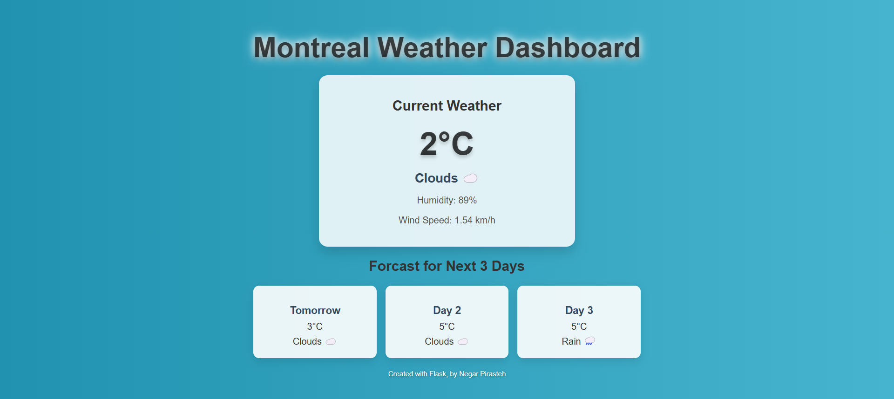

# Flask Weather Forecast Web App 🌤️🌡️

A dynamic weather forecast web application built with Flask using Python and integrated with the **OpenWeatherMap API** for real-time weather data. This application provides **current weather conditions** and a **3-day forecast** for with visually appealing and responsive design.

---

## Features 🚀

- **Real-Time Weather Data**: Fetches current weather conditions (temperature, weather type, humidity, and wind speed) from the OpenWeatherMap API for **Montreal**.
- **3-Day Forecast**: Displays upcoming **Montreal** weather conditions, including temperature and weather type, with a clean card layout.
- **Dynamic Styling**: Integrates weather-related emojis and temperature-based styling for a modern, user-friendly experience.
- **Responsive Design**: Optimized for both desktop and mobile devices.
- **API Integration**: Powered by the **OpenWeatherMap API** for real-time weather updates.

---

## Technologies Used 🛠️

- **Python**: Backend logic and API integration.
- **Flask**: Lightweight web framework for handling routes and rendering templates.
- **HTML & CSS**: For creating a responsive and visually appealing user interface.
- **OpenWeatherMap API**: Fetches live weather data.

---

## Getting Started 📦

### Prerequisites

- **Python 3.x** installed on your machine.
- An **OpenWeatherMap API key** for accessing real-time weather data.

---

### Installation

1. **Clone the repository**

   ```bash
   git clone https://github.com/negarprh/Flask-Weather-App.git
   cd Flask-Weather-App
   ```

2. **Create & activate a virtual environment**

   ```bash
   # macOS/Linux
   python3 -m venv .venv
   source .venv/bin/activate

   # Windows (PowerShell)
   python -m venv .venv
   .\.venv\Scripts\Activate.ps1
   ```

3. **Install dependencies**

   ```bash
   pip install -r requirements.txt
   ```

4. **Configure environment variables (do NOT commit .env)**

   ```bash
   # create your local env file
   cp .env.example .env        # macOS/Linux
   # Windows (PowerShell):
   Copy-Item .env.example .env
   ```

   Edit `.env` and put your OpenWeather key:

   ```
   OPENWEATHER_API_KEY=YOUR_KEY_HERE
   ```

5. **Run the application**

   ```bash
   flask --app main run
   ```

   Then open `http://127.0.0.1:5000`.

---

## API Integration 🌐

This app uses **OpenWeatherMap** to fetch live data.

1. **Current Weather endpoint**

   * URL: `https://api.openweathermap.org/data/2.5/weather`
   * Example:

     ```bash
     curl "https://api.openweathermap.org/data/2.5/weather?q=Montreal&appid=YOUR_KEY&units=metric"
     ```

2. **5-Day / 3-Hour Forecast endpoint**

   * URL: `https://api.openweathermap.org/data/2.5/forecast`
   * Example:

     ```bash
     curl "https://api.openweathermap.org/data/2.5/forecast?q=Montreal&appid=YOUR_KEY&units=metric"
     ```

3. **API Key handling**

   * Generate a key at [https://openweathermap.org/](https://openweathermap.org/)
   * Store it in `.env` as `OPENWEATHER_API_KEY`.
   * The app reads it via `python-dotenv`; **do not hard-code keys in code**.


---

### Project Structure 📂

```plaintext
flask_weather_app/
├── .venv/                 # Virtual environment files
├── static/
│   └── style.css          # CSS file for styling
├── templates/
│   ├── base.html          # Base HTML template
│   └── weather.html       # Weather display template
├── main.py                # Main Flask application file with API integration
├── README.md              # Project documentation
├── requirement.txt        # Project dependencies
└── website_screenshot.png # Screenshot for README
```

---

## Usage 🖥️

1. Launch the app and view the current weather fetched from the OpenWeatherMap API.
2. The app displays:
   - Current temperature (with dynamic gradient styling).
   - Weather condition (with emoji-based visual representation).
   - Humidity and wind speed.
3. Scroll down to see a 3-day forecast with detailed weather conditions.

---

## Screenshots 📸

### Application Preview


---


## Contributing 🤝

Contributions are welcome! If you have ideas for enhancements, bug fixes, or additional features, feel free to fork the repository and submit a pull request.

---

## Future Improvements 🌟
Integrate geolocation to dynamically fetch weather data based on the user's current location.
Add a search functionality to allow users to check weather for any city.

---

## License 📜

This project is licensed under the **MIT License**. See the [LICENSE](LICENSE) file for details.

---

## Acknowledgments 🙏

- [Flask Documentation](https://flask.palletsprojects.com/)
- [OpenWeatherMap API](https://openweathermap.org/) for providing live weather data.
- Design inspiration from modern UI/UX principles.

---

Feel free to use this for your GitHub repository! Let me know if you want further changes. 😊
